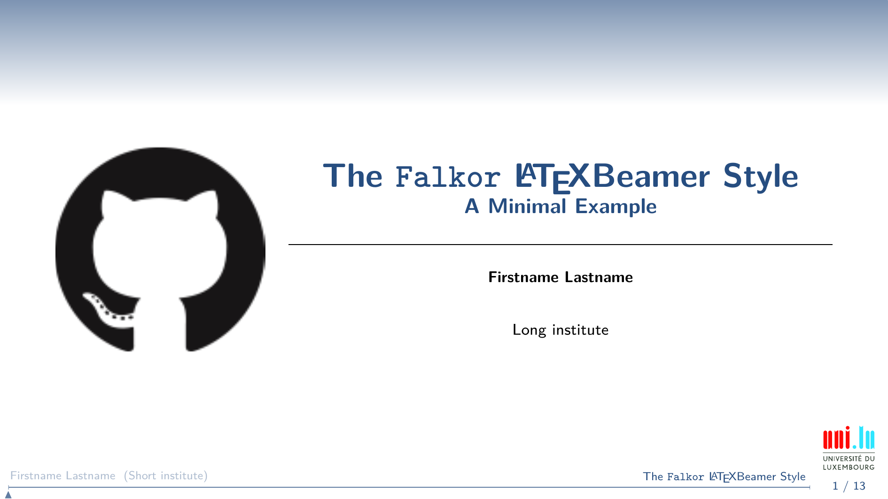
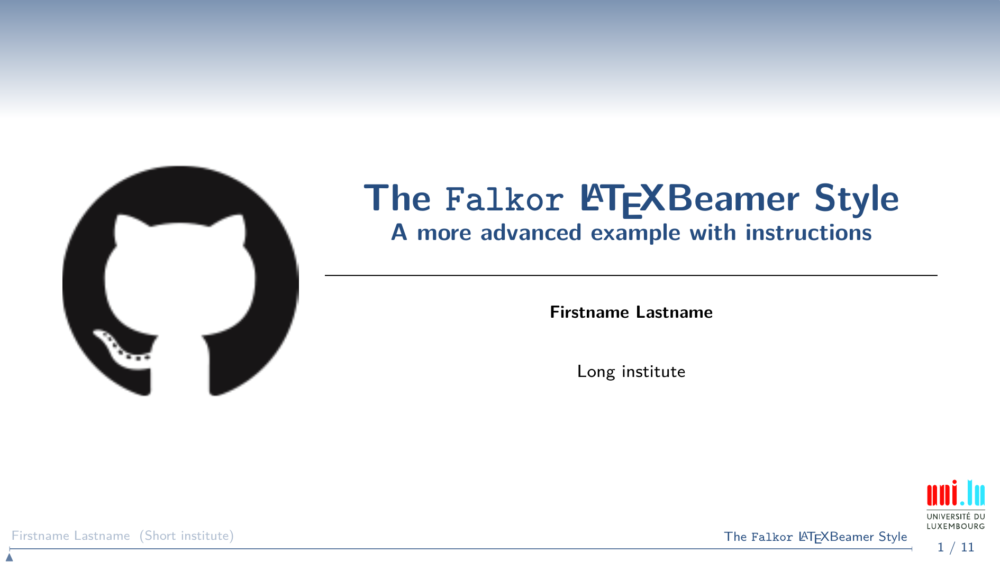
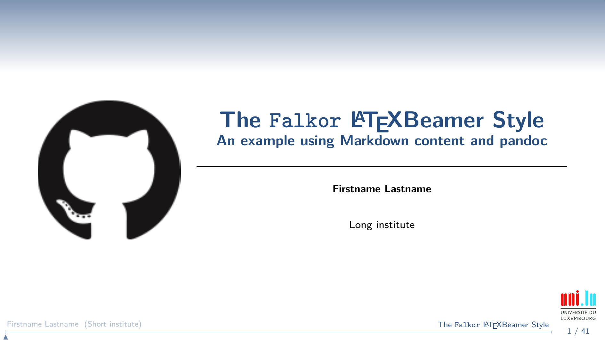

-*- mode: markdown; mode: visual-line; -*-

[](http://creativecommons.org/licenses/by-nc-sa/4.0)[](https://travis-ci.org/Falkor/beamerthemeFalkor)

                 _____     _ _                ____
                |  ___|_ _| | | _____  _ __  | __ )  ___  __ _ _ __ ___   ___ _ __
                | |_ / _` | | |/ / _ \| '__| |  _ \ / _ \/ _` | '_ ` _ \ / _ \ '__|
                |  _| (_| | |   < (_) | |    | |_) |  __/ (_| | | | | | |  __/ |
                |_|  \__,_|_|_|\_\___/|_|    |____/ \___|\__,_|_| |_| |_|\___|_|
    
                                  _____ _
                                 |_   _| |__   ___ _ __ ___   ___
                                   | | | '_ \ / _ \ '_ ` _ \ / _ \
                                   | | | | | |  __/ | | | | |  __/
                                   |_| |_| |_|\___|_| |_| |_|\___|
    
                  Copyright (c) 2015-2024 Sebastien Varrette <sebastien.varrette@gmail.com>

| [Project Page](https://github.com/Falkor/beamerthemeFalkor) | [Sources](https://github.com/Falkor/beamerthemeFalkor) |  [Issues](https://github.com/Falkor/beamerthemeFalkor/issues)             |

## Synopsis

This repository holds my personal LaTeX Beamer theme, provided in a working environment.

This theme is largely based on the [progressbar](http://recherche.noiraudes.net/fr/LaTeX.php) beamer theme (by Sylvain Bouveret) with my own customization to fit my tastes.
So feel free to send him a postal card (as he asks for ;) )

      Progressbar Version: 0.42 September 2010.

## Reopository Installation

This repository is hosted on [Github](https://github.com/Falkor/beamerthemeFalkor). To clone it and setup it with, proceed as follows:

```bash
# Eventually to keep things organised...
mkdir -p ~/git/github.com/Falkor
cd ~/git/github.com/Falkor
# Clone and setup
git clone https://github.com/Falkor/beamerthemeFalkor.git
cd beamerthemefalkor
make setup
```

## Beamer Theme installation

* Either **copy** `beamerthemeFalkor.sty` at the root of (each of) your LaTeX sources:
  ```bash
  wget https://raw.githubusercontent.com/Falkor/beamerthemeFalkor/master/beamerthemeFalkor.sty
  ```
* Or install it globally:
  ```bash
  # Find the directory where your latex packages are installed.
  kpsewhich -var-value TEXMFHOME   # Normally: ~/texmf
  # create the directory or a symplink toward the working copy of this reposirory in that placed
  mkdir -p $(kpsewhich -var-value TEXMFHOME)/tex/latex
  # ... assuming you are in the local directory where you cloned this repository
  ln -s $(pwd) $(kpsewhich -var-value TEXMFHOME)/tex/latex/beamertheme-Falkor
  # generate an index of that tree
  texhash $(kpsewhich -var-value TEXMFHOME)
  ```
* Or make it a git submodule of your repository hosting the beamer Latex sources (my prefered way):
  ```bash
  # From the root repository hosting your LaTeX Beamer slides, assuming a **clean** (non-dirty) state:
  git submodule add https://github.com/Falkor/beamerthemeFalkor .submodules/beamerthemeFalkor
  git commit -a -s -m "Add Git submodule '.submodules/beamerthemeFalkor' from 'https://github.com/Falkor/beamerthemeFalkor'"
  # ... then in the slides sources, symlink beamerthemeFalkor.sty to the submodules directory.
  # Personnaly, this is how I like to setup it:
  cd slides/<year>/<topic>/src  # I prefer to keep LaTeX sources separated into src/
  # Create a symlink to the git root directory
  ln -s $(git rev-parse --show-cdup) .root
  # symlink beamerthemeFalkor.sty from there
  ln -s .root/.submodules/beamerthemeFalkor/beamerthemeFalkor.sty beamerthemeFalkor.sty
  git add .root  beamerthemeFalkor.sty
  git commit -s -m "setup beamerthemeFalkor.sty from associated git submodule"
  ```

The later has the advantage to ensure all collaborators get the same version of the theme, howerver it also means that you have to provide a way for them (`make setup` etc.) to initiate correctly the git submodules within their own repository...


## Theme Usage

Once installed, you can use this theme as follows (basically, you **MUST** configure the main image and the logo:

```latex
\documentclass[aspectratio=169]{beamer}

% customize the image using the image=<path> option - use relative path!
\usetheme[image=logo_github.png]{Falkor}

% Mandatory to **declare** a logo to be placed on the bottom right -- use again relative path to the image
\pgfdeclareimage[height=0.8cm]{logo}{logo_UL.pdf}
% Ex:
% \pgfdeclareimage[height=0.8cm]{logo}{logos/logo_RF.png}
```

You probably want to use [my own LaTeX Makefile](https://github.com/Falkor/Makefiles/blob/devel/latex/Makefile) combined with my generic [LaTeX style file](https://github.com/Falkor/Makefiles/blob/devel/latex/template-article-styles/_style.sty) as done in the [advanced example](examples/advanced)

## Examples

All customization / installation instructions are better described in the sample PDF produced using this theme:

* a [Minimal](examples/minimal.pdf) example -- [sources](examples/minimal/)
* a [more complete](examples/advanced.pdf) example with usage instructions -- [sources](examples/advanced/)
* you can (who said should?) at least try to combine it with [markdown](http://daringfireball.net/projects/markdown/) and [pandoc](http://pandoc.org/).
   - an [example based on markdown](examples/markdown.pdf) is also provided -- [sources](examples/markdown/)

### Minimal example

[](examples/minimal.pdf)


### More advanced example

[](examples/advanced.pdf)


## Markdown-based Beamer Workflow

* Install [pandoc](http://pandoc.org/)
* Rely on my [LaTeX Makefile](https://github.com/Falkor/Makefiles/blob/devel/latex/Makefile) (or define your own)
* Rely on a main file in LaTeX
    - split markdown content in individual Markdown files
    - these file **SHOULD HAVE** the `.md` extension
	- my `Makefile` compile all `.md` files into `.md.tex` LaTeX files using:

            pandoc –from markdown –to beamer –slide-level 3 -o <filename>.md.tex <filename>.md

* Simply include the markdown files using `\input{<filename>.md}`
    - in practice, `<filename>.md.tex` is considered for inclusion since the `.tex` extension is automatically appended.

You can see a concrete example in [`examples/markdown/`](examples/markdown).
In particular, you might consider the [markdown file](examples/markdown/_content_in_markdown.md) used to produce the slides (see also the [raw markdown version](https://raw.githubusercontent.com/Falkor/beamerthemeFalkor/master/examples/markdown/_content_in_markdown.md))


[](examples/markdown.pdf)


## Automatic Tests of Falkor/beamerthemeFalkor

A set of simple tests based on [Bats](https://github.com/sstephenson/bats): "Bash Automated Testing System" are proposed on the `tests/` directory, and served to validate that this theme permits a successful compilation of the sample slides proposed on the `examples/` directory.
For more information, see [tests/README.md](tests/README.md).

You can run these tests by issuing:

```bash
     make tests # OR make bats OR make test
```
## Developments Aspects

If you wish to contribute directly to this repository and its content, you
should be aware of the development workflow I follow for this repository

### [Git-flow](https://github.com/nvie/gitflow)

The Git branching model for this repository follows the guidelines of [gitflow](http://nvie.com/posts/a-successful-git-branching-model/).
In particular, the central repository holds two main branches with an infinite lifetime:

* `production`: the *production-ready* branch
* `master`: the main branch where the latest developments interviene. This is the *default* branch you get when you clone the repository.

Thus you are more than encouraged to install the [git-flow](https://github.com/nvie/gitflow) extensions following the [installation procedures](https://github.com/nvie/gitflow/wiki/Installation) to take full advantage of the proposed operations. The associated [bash completion](https://github.com/bobthecow/git-flow-completion) might interest you also.

### Releasing mechanism

The operation consisting of releasing a new version of this repository is automated by a set of tasks within the root `Makefile`.

In this context, a version number have the following format:

      <major>.<minor>.<patch>[-b<build>]

where:

* `< major >` corresponds to the major version number
* `< minor >` corresponds to the minor version number
* `< patch >` corresponds to the patching version number
* (eventually) `< build >` states the build number _i.e._ the total number of commits within the `master` branch.

Example: \`1.0.0-b28\`

The current version number is stored in the root file `VERSION`. __/!\ NEVER MAKE ANY MANUAL CHANGES TO THIS FILE__

For more information on the version, run:

     $> make versioninfo

If a new version number such be bumped, you simply have to run:

      $> make start_bump_{major,minor,patch}

This will start the release process for you using `git-flow`.
Once you have finished to commit your last changes, make the release effective by running:

      $> make release

it will finish the release using `git-flow`, create the appropriate tag in the `production` branch and merge all things the way they should be.

## Licence

This project is released under the terms of the [CC by-nc-sa](LICENCE) licence.

[](http://creativecommons.org/licenses/by-nc-sa/4.0)

## Contributing

That's quite simple:

1. [Fork](https://help.github.com/articles/fork-a-repo/) it
2. Create your own feature branch (`git checkout -b my-new-feature`)
3. Commit your changes (`git commit -am 'Added some feature'`)
4. Push to the branch (`git push origin my-new-feature`)
5. Create a new [Pull Request](https://help.github.com/articles/using-pull-requests/)

## Acknowledgements

* Sylvain Bouveret for the initial [progressbar](http://recherche.noiraudes.net/fr/LaTeX.php) beamer theme
* Jakub Muszynski for the updates and correction he found when designing his own PhD. defense
* Xavier Besseron and Joseph Emeras for motivating me to investigate the Markdown path and raising (as always) good ideas.
